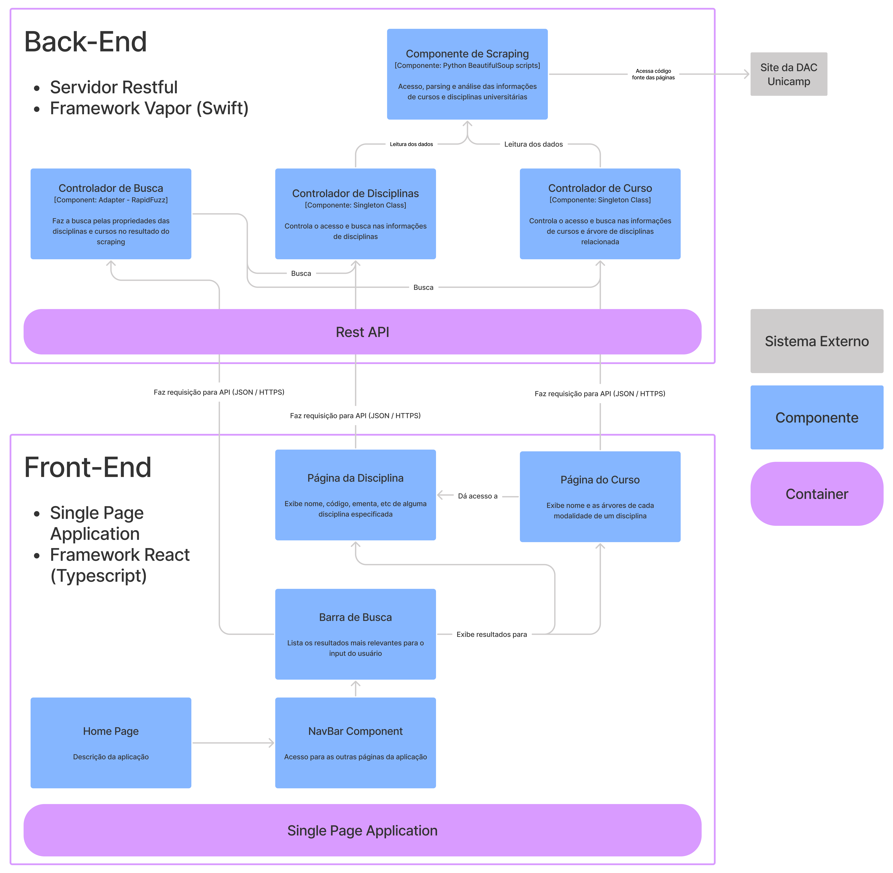

# Planejador de Disciplinas (Projeto de MC426)

Uma explicação em vídeo com demonstração desse projeto pode ser encontrada [aqui](https://youtu.be/p_p-Px1tfUs).

Esse projeto tem como objetivo principal desenvolver uma plataforma para auxiliar estudantes de universidades públicas a planejar as disciplinas que irão cursar.

Para isso, serão levados em conta conflitos de horário e pré-requisitos necessários para cursar as diferentes disciplinas.

Como objetivos secundários, pondera-se implementar a visualização da árvore de disciplinas do estudante, troca de mensagens entre os usuários, interações entre serviços já existentes de calendário, entre outros.

## Diagrama de Arquitetura

O diagrama C4 nível 3 da arquitetura do projeto, englobando front e back-end, está na figura abaixo.



### Estilos Arquiteturais

Como mostrado no diagrama, o projeto utiliza um estilo de API RESTful para requisições entre o front e o back-end. Além disso, o front-end é construído baseado no estilo *Single Page Application* (SPA).

### Padrões de Projeto

O padrão de projeto adotado para alguns componentes também está nas respectivas descrições no diagrama. São eles:

- Controladores de cursos e disciplinas
    - Implementação como *singletons*
- Controlador de busca
    - Implementação como *adapter* que comunica com a biblioteca *RapidFuzz* em C++

## Instruções de Submódulos

Ao clonar, utilizar

```bash
git clone --recursive
```

Se os submódulos não funcionarem, usar:

```bash
git submodule init
git submodule update
```

Para facilitar, podemos criar dois comandos: `spull` e `spush`, que pulla e pusha todos os submódulos ao mesmo tempo. Para isso, rode no terminal os seguintes comandos [(fonte)](https://medium.com/@porteneuve/mastering-git-submodules-34c65e940407):

```bash
git config --global alias.spull '!git pull && git submodule sync --recursive && git submodule update --init --recursive'

git config --global alias.spull '__git_spull() { git pull "$@" && git submodule sync --recursive && git submodule update --init --recursive; }; __git_spull'

git config --global alias.spush 'push --recurse-submodules=on-demand'
```
